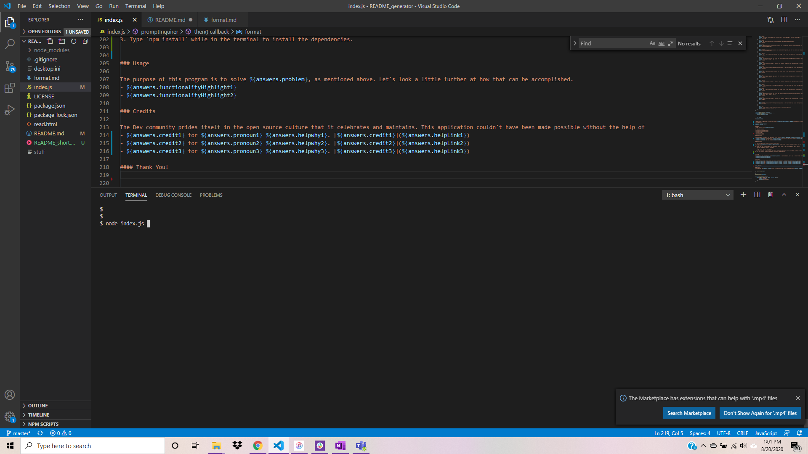

# README Generator

 

This is a node.js application that will Prompt the user to answer a series of questions which are then dynamically added to a template. Immediately following a README.md file is generated in the application folder and is ready to commit.
Developers spend months on an application, but only an hour on their readme. This application creates a quality README.md file without all the headaches of formating and styling
       
## Table of Contents
        
- [Technologies](#technologies)
- [Installation](#installation)
- [Usage](#usage)
- [Credits](#credits)
- [License](#license)
- [Questions](#questions)
    
### Technologies
    
The technologies utilized in this application are as follows: inquirer, Instant Markdown by David Bankier, and screencastify. 
- inquirer was used because Inquirer is a package that creats the Prompt experience that is popular in the web browser.
- Instant Markdown by David Bankier was used because This VSC extension opens a live localhost in the browers so that you can make changes to your .md file and see them real time.. 
- screencastify was used because Screencastify is an online application that aids the dev to record their local screen to demonstrate the functionality of a program, which is especially useful with node.js applications that do not have a flashy browser type output.. 
    
### Installation
    
To run this application successfully follow these steps:
1. Install [README_generator](https://github.com/JoannaTanveer/README_generator) to your local drive vis terminal/GitBash. This will install the package.json file which contains a list of all the dependencies for this application. 

2. Verify that node is installed in your computer by typing 'node' in the terminal/GitBash. If it returns
    >Welcome to Node.js v12.14.1. (or higher)
    >
    >Type ".help" for more information.
    
 Node.js is installed in your computer. If nothing happens or there is an error, visit [Node.js](https://nodejs.org/) and install the LTS version.
3. Type 'npm install' while in the terminal to install the dependencies. 

### Usage
    
The purpose of this program is to solve Developers spend months on an application, but only an hour on their readme. This application creates a quality README.md file without all the headaches of formating and styling, as mentioned above. Let's look a little further at how that can be accomplished.
- Inquirer functionality helps to take in user input and organize it.
- the filesystem function of node.js is able to write, read and append files on the local computer.
    
### Credits
    
The Dev community prides itself in the open source culture that it celebrates and maintains. This application couldn't have been made possible without the help of
- Anthony Zachry for his undefined. [Anthony Zachry](https://github.com/anthonychry)
- Brian Duimstra for his undefined. [Brian Duimstra](https://www.linkedin.com/in/brian-duimstra-61878525/)
- makeareadme for it's undefined. [makeareadme](https://www.makeareadme.com)
    
#### Thank You!
    
    
### License
Licensed under the MIT license. 

### Questions
All questions and comments are welcome! Please contact me at joanna.tanveer@gmail.com or visit my GitHub profile [Github Profile](https://github.com/${answers.userName})
